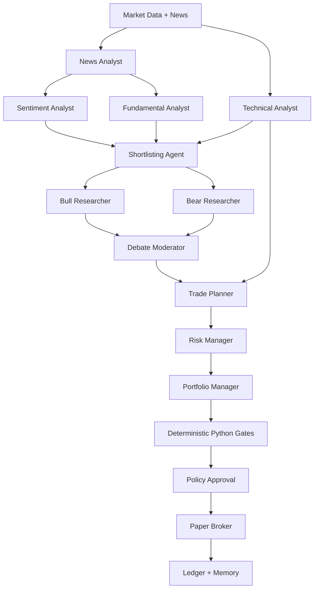
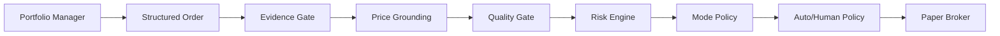
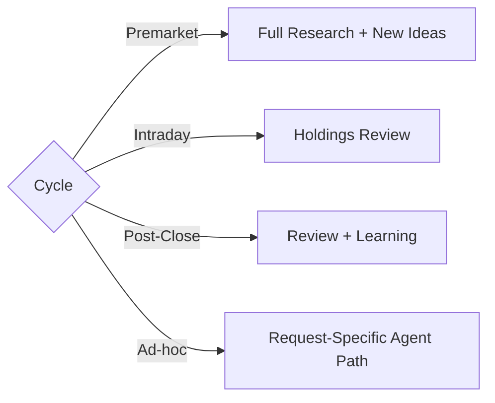

# TradeLoop

### A Multi-Agent Decision Framework for Evidence-Driven Trading

TradeLoop explores a broader question than algorithmic trading:

> **How do you make multiple AI agents reason together on a high-stakes decision without giving any single LLM uncontrolled authority?**

The system models an **AI investment committee**.

Different agents specialize in news, sentiment, fundamentals, technical analysis, opposing research, risk, and portfolio management. They communicate through structured artifacts and progressively transform raw market information into a final decision.

The LLMs **reason**.

Deterministic Python **controls**.

`Python` · `Multi-Agent Systems` · `Pydantic` · `LLMs` · `Zerodha` · `OpenRouter` · `Claude` · `OpenCode`

---

# The Core Idea

A single-agent trading system might look like:

```text id="eg21ul"
Market Data
     │
     ▼
    LLM
     │
     ▼
 "Buy XYZ"
```

That concentrates research, reasoning, risk and execution inside one opaque model call.

TradeLoop instead separates responsibility.

```text id="rj6hkl"
                    AI INVESTMENT COMMITTEE

Market Evidence
      │
      ▼
┌─────────────────┐
│ Research Agents │
└────────┬────────┘
         ▼
┌─────────────────┐
│ Bull vs Bear    │
│    Debate       │
└────────┬────────┘
         ▼
┌─────────────────┐
│ Trader / Planner│
└────────┬────────┘
         ▼
┌─────────────────┐
│  Risk Manager   │
└────────┬────────┘
         ▼
┌─────────────────┐
│ Portfolio Mgr   │
└────────┬────────┘
         ▼
   Proposed Decision
         │
         ▼
 Deterministic Gates
         │
         ▼
   Policy Approval
         │
         ▼
    Paper Broker
```

No research agent can place an order.

No debate agent controls risk.

No LLM decides position sizing.

Each component has one responsibility.

---

# Multi-Agent Architecture



---

# Agent Roles

The system uses specialized prompts rather than one general-purpose agent.

```text id="1vaalz"
01  News Analyst
       ↓
02  Sentiment Analyst
       ↓
03  Fundamental Analyst
       ↓
04  Technical Analyst
       ↓
05  Shortlisting Agent
       ↓
 ┌───────────────┐
 │               │
 ▼               ▼
Bull Agent     Bear Agent
 │               │
 └───────┬───────┘
         ▼
  Debate Moderator
         ↓
    Trade Planner
         ↓
    Risk Manager
         ↓
 Portfolio Manager
```

Additional agents handle:

* existing holdings;
* ad-hoc research requests;
* post-trade analysis and learning.

Not every role runs during every cycle.

The graph changes depending on the task.

---

# Agents Communicate Through Artifacts

Agents do not share a giant conversation history.

Each stage receives only explicitly defined upstream artifacts.

```text id="n5jxvr"
News Agent
   │
   └──► 10_news.json
            │
            ▼
     Sentiment Agent
            │
            └──► 11_sentiment.json
                     │
                     ▼
              Shortlisting Agent
                     │
                     └──► 14_shortlist.json
                              │
                     ┌────────┴────────┐
                     ▼                 ▼
                 Bull Agent        Bear Agent
                     │                 │
                     └────────┬────────┘
                              ▼
                         Debate Agent
```

This creates explicit **agent contracts**.

Every handoff is inspectable.

---

# Structured Agent Outputs

Each agent must produce output matching a predefined **Pydantic schema**.

```text id="bf8e6j"
Agent
  │
  ▼
LLM Response
  │
  ▼
Schema Validation
  │
  ├── Invalid ──► Retry
  │
  ▼
Validated Artifact
  │
  ├── JSON
  └── Markdown
```

A stage cannot silently return arbitrary prose and continue through the system.

Invalid output fails the stage instead of becoming a trading decision.

---

# Bull vs Bear: Deliberate Disagreement

One of the central design choices is to **manufacture disagreement**.

Instead of asking one model:

> “Should I buy this?”

TradeLoop asks different agents to defend opposing interpretations.

```text id="q5l6p5"
             Candidate

          ┌──────┴──────┐
          ▼             ▼
      Bull Agent     Bear Agent

     "Why this       "Why this
      works"          fails"

          │             │
          └──────┬──────┘
                 ▼
          Debate Moderator
                 │
                 ▼
           Balanced Thesis
```

The trade planner sees the debate rather than only the strongest bullish argument.

This makes **adversarial reasoning part of the architecture**.

---

# LLM Reasoning vs Deterministic Control

TradeLoop deliberately separates judgment from authority.

```text id="xtkmpg"
           LLM DOMAIN

News interpretation
Sentiment
Fundamentals
Technical reasoning
Bull thesis
Bear thesis
Debate
Trade thesis
Risk assessment
Portfolio judgment

                │
                ▼

        DETERMINISTIC BOUNDARY

Position sizing
Order schemas
Risk limits
Price grounding
Evidence validation
Cycle policy
Kill switch
Order routing
Ledger
```

The model may recommend a position.

It cannot decide the final quantity arbitrarily.

Python computes sizing deterministically after the trade-plan stage.

---

# Safety Architecture

A proposed order travels through several boundaries before it can reach even the paper broker.



Possible outcomes:

```text id="twlfit"
Proposed Order
     │
     ├── Missing evidence ──────► BLOCK
     ├── Invented price ────────► BLOCK
     ├── Poor analysis quality ─► BLOCK
     ├── Risk violation ────────► BLOCK
     ├── Wrong cycle mode ──────► BLOCK
     │
     └── Valid
           ↓
      Auto-route paper or await exception review
```

**LLM confidence alone is never sufficient authorization.**

---

# Evidence Grounding

Agents cannot freely invent supporting evidence.

The system maintains canonical evidence identifiers from the frozen market/news snapshot.

```text id="euhluf"
Market Snapshot
     │
     ├── evidence_001
     ├── evidence_002
     └── evidence_003
             │
             ▼
         Agent Claim
             │
             ▼
     Evidence Validation
```

Evidence references are canonicalized and validated before the proposal is accepted.

Trade entry and stop prices are also checked against frozen scanner levels.

---

# Resumable Multi-Agent Execution

Multi-agent workflows can be expensive.

A failure at agent #9 should not require rerunning agents #1–8.

TradeLoop persists every validated stage.

```text id="uo0u9w"
Agent 1 ✓
Agent 2 ✓
Agent 3 ✓
Agent 4 ✓
Agent 5 ✕

      process interrupted

          ↓ RESUME

Agent 1 ─ skip
Agent 2 ─ skip
Agent 3 ─ skip
Agent 4 ─ skip
Agent 5 ─ retry
```

Validated artifacts become checkpoints.

This makes the orchestration:

* resumable;
* auditable;
* cheaper to recover;
* easier to debug.

---

# Multiple LLM Backends, One Agent Graph

The reasoning graph is model-provider independent.

```text id="4qq6gj"
                Agent DAG
                   │
        ┌──────────┼───────────┐
        ▼          ▼           ▼
     Claude     OpenCode    OpenRouter
        │          │           │
        └──────────┼───────────┘
                   ▼
          Same Structured Outputs
                   │
                   ▼
           Same Risk Controls
```

Changing the LLM backend does not change the execution policy.

The same schemas and deterministic gates remain authoritative.

---

# Cycle-Aware Agent Graphs

TradeLoop does not run every agent indiscriminately.

The graph adapts to the task.



### Premarket

```text id="7e9fm9"
Research
  ↓
Debate
  ↓
Plan
  ↓
Risk
  ↓
Portfolio Decision
```

### Intraday

```text id="rsn4ys"
Existing Positions
       ↓
Holdings Review
       ↓
Hold / Add / Trim / Exit / Tighten Stop
```

### Post-close

```text id="xek1td"
Completed Activity
       ↓
Attribution
       ↓
Post-Trade Analysis
       ↓
Memory
```

### Ad-hoc

An intake agent determines which stages are actually necessary.

```text id="626vej"
User Request
     ↓
Intake Agent
     ↓
Required Stages Only
```

---

# Memory and Learning

Agent decisions should not disappear after one execution.

```text id="4u8c55"
Today's Decision
      │
      ▼
Paper Execution
      │
      ▼
Audit Ledger
      │
      ▼
Post-Trade Review
      │
      ▼
Memory
      │
      ▼
Future Context
```

The system maintains:

```text id="d8e0rw"
memory/
├── journal
├── lessons
├── company dossiers
├── strategy performance
└── carry-forward context
```

Past holdings analysis can therefore become structured context for a future cycle.

---

# Auditability

Every run creates its own artifact directory.

```text id="8ktuhm"
runs/<cycle>/
│
├── market snapshot
├── raw news
├── technical setups
│
├── 10_news.json
├── 11_sentiment.json
├── 12_fundamentals.json
├── 13_technical.json
├── 14_shortlist.json
│
├── 20_bull.json
├── 21_bear.json
├── 22_debate.json
│
├── 30_trade_plan.json
├── 40_risk_report.json
├── 41_pm_decision.json
│
├── orders.json
├── gate_summary.json
├── fills.json
└── audit artifacts
```

A final decision can therefore be traced backwards through the reasoning chain.

```text id="10wo5t"
Order
  ↑
Portfolio Decision
  ↑
Risk Report
  ↑
Trade Plan
  ↑
Debate
  ↑
Bull + Bear Research
  ↑
Shortlist
  ↑
Fundamentals + Technicals + Sentiment
  ↑
Market Evidence
```

---

# Running TradeLoop

Install the Python package:

```bash id="yq0c65"
conda activate tradingbot
python -m pip install -e ".[dev]"
```

Configure the Zerodha integration:

```bash id="279ci4"
npm install
cp .env.example .env
npm run auth:zerodha -- --listen
```

Run a complete multi-agent premarket cycle.
By default, TradeLoop runs in autonomous paper mode: valid paper orders route automatically after deterministic gates pass, while live auto-routing stays locked unless explicitly enabled.

```bash id="txdlrw"
ZERODHA_ENABLE_DATA=true \
python -m tradeloop.orchestrator premarket
```

The system reasons, validates the decision, and either auto-routes paper orders or records the exact blocking gate:

```text id="t8knxq"
Agents
   ↓
PM Decision
   ↓
Orders Proposal
   ↓
Deterministic Gates
   ↓
Paper Auto-Route / Blocked / Exception Review
```

You can still manually route a selected paper run from the dashboard or CLI when reviewing an exception:

```bash id="l9ojup"
python -m tradeloop.orchestrator route \
  tradeloop/runs/<timestamp>_premarket
```

---

# Dashboard

The dynamic operator dashboard shows autopilot state, latest decision, gates, risk exposure, agents, portfolio, and run history.

```bash id="j8b312"
python -m tradeloop.dashboard
```

```text id="by6h7n"
http://127.0.0.1:8770
```

---

# Why TradeLoop Exists

TradeLoop started from a problem that applies well beyond markets:

> **LLMs are good at reasoning, but high-stakes systems need separation of responsibility, disagreement, validation, memory, and deterministic authority.**

Trading provides a useful environment for testing those ideas because decisions have:

* incomplete information;
* competing interpretations;
* explicit risk;
* measurable outcomes;
* persistent state;
* consequences for bad reasoning.

So the deeper system being explored is not merely:

```text id="jdkfzb"
AI → Trading
```

It is:

```text id="tcq163"
                  HIGH-STAKES AI

Evidence
   ↓
Specialist Agents
   ↓
Structured Handoffs
   ↓
Adversarial Debate
   ↓
Decision Agent
   ↓
Deterministic Validation
   ↓
Auto/Human Policy Approval
   ↓
Action
   ↓
Audit + Memory
```

The trading domain is the testbed.

**The architecture is a reusable pattern for controlled multi-agent systems.**
